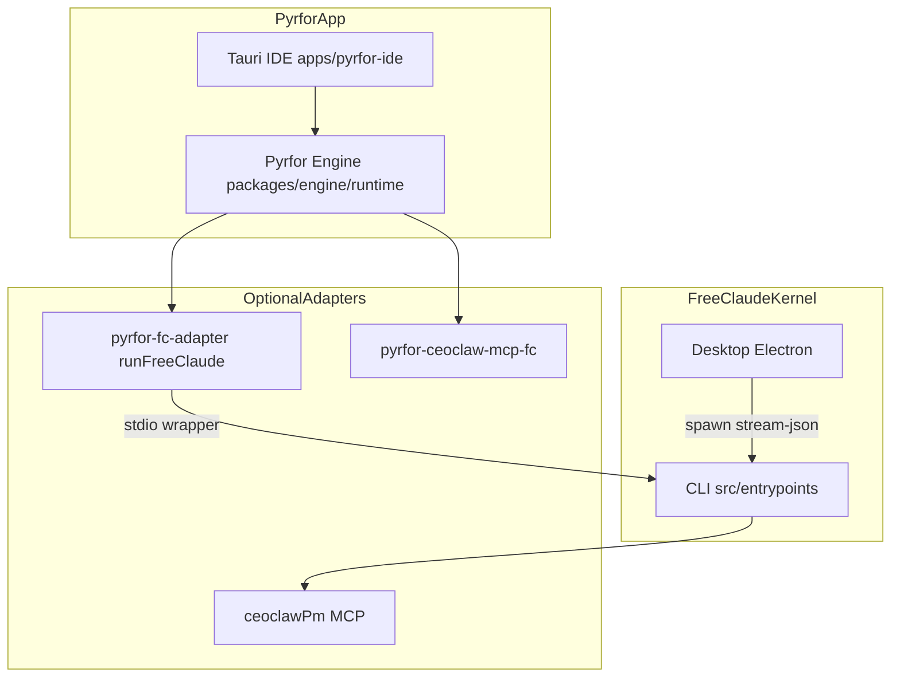
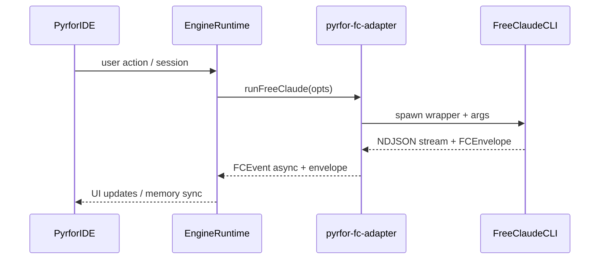

# 00 — Ecosystem macro-architecture

## English

This document describes how **Pyrfor** (local-first AI coding control plane), **FreeClaude** (autonomous execution kernel / CLI), **FreeClaude Desktop** (Electron client), **CEOClaw** (PM vertical + MCP), and optional **1C OData** relate at the system level.

### Roles (canonical)

| Component | Role |
|-----------|------|
| **Pyrfor** | Owns the Tauri IDE, canonical engine runtime under `packages/engine/src/runtime`, MCP gateway, SQLite memory, subagent lifecycle, and optional adapters (FreeClaude, CEOClaw, Telegram, 1C). See the [Pyrfor README](https://github.com/alexgrebeshok-coder/pyrfor/blob/main/README.md). |
| **FreeClaude Engine** | The FreeClaude CLI process when invoked with `--output-format stream-json` (and related flags). Exposes a stable **wrapper envelope** and NDJSON event stream for supervisors (Pyrfor adapter, Desktop bridge, MCP clients). See root [README.md](../../README.md) “Canonical Role” and [CHANGELOG.md](../../CHANGELOG.md) for Pyrfor↔FC contract notes. |
| **FreeClaude Desktop** | Separate Electron product: spawns the FreeClaude CLI and parses `stream-json` over IPC. Does not replace Pyrfor IDE; it is another consumer of the same CLI contract. |
| **CEOClaw** | PM tools: in-process MCP in FreeClaude (`src/services/mcp/servers/ceoclawPm.ts`) plus standalone server under `mcp-servers/ceoclaw-pm/`. On Pyrfor, optional bridge `pyrfor-ceoclaw-mcp-fc.ts` in the engine runtime. |
| **`~/.pyrfor` / `~/.freeclaude`** | Runtime state and config (do not commit secrets). |

**Integration scope (Pyrfor):** which connectors are optional vs first-run — see [Pyrfor `docs/integrations.md`](https://github.com/alexgrebeshok-coder/pyrfor/blob/main/docs/integrations.md).

### Product boundaries

### Control and data flow (FreeClaude run from Pyrfor)

### Persistence (high level)

- **Pyrfor**: primary runtime config per Pyrfor README (`~/.pyrfor/runtime.json`); optional `pyrfor.json` legacy paths; orchestration logs under `~/.pyrfor/orchestration/` (e.g. `events.jsonl`).
- **FreeClaude**: `~/.freeclaude/`, `~/.freeclaude.json`, task ledger under `~/.freeclaude/tasks/`, vault per README.

---

## Русский

Здесь зафиксировано **макро-устройство экосистемы**: как **Pyrfor** (локальная control plane для AI-кода), **FreeClaude** (ядро исполнения / CLI), **FreeClaude Desktop** (отдельный Electron-клиент), **CEOClaw** (PM + MCP) и опционально **1C OData** сосуществуют.

### Роли

| Компонент | Роль |
|-----------|------|
| **Pyrfor** | IDE на Tauri, канонический рантайм в `packages/engine/src/runtime`, MCP-шлюз, память SQLite, субагенты, опциональные адаптеры (FreeClaude, CEOClaw, Telegram, 1C). |
| **FreeClaude Engine** | Процесс CLI с `stream-json`: конверт для супервизоров (адаптер Pyrfor, мост Desktop, MCP). |
| **FreeClaude Desktop** | Отдельное приложение: порождает тот же CLI и парсит поток событий. |
| **CEOClaw** | MCP в FreeClaude + отдельный пакет `mcp-servers/ceoclaw-pm/`; на стороне Pyrfor — `pyrfor-ceoclaw-mcp-fc.ts`. |

Таблица опциональных интеграций Pyrfor: [integrations.md](https://github.com/alexgrebeshok-coder/pyrfor/blob/main/docs/integrations.md).

Диаграммы **Product boundaries** и **Control and data flow** выше дублируют смысл на универсальном языке (Mermaid).

### Хранилища

- **Pyrfor**: см. корневой README Pyrfor (`runtime.json`, при необходимости legacy `pyrfor.json`), логи оркестрации в `~/.pyrfor/orchestration/`.
- **FreeClaude**: `~/.freeclaude/`, задачи, vault — см. [README.md](../../README.md).

**Безопасность:** не вставляйте токены из `~/.pyrfor` или `~/.freeclaude` в документацию.
