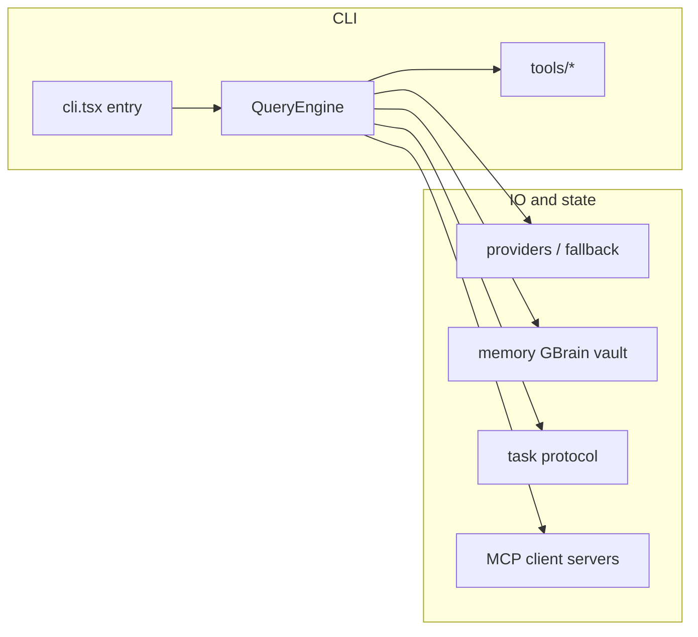

# 01 — FreeClaude CLI core

## English

The **CLI** is the primary execution surface. It loads providers, runs the tool loop, enforces permissions, streams assistant output, and owns most user-visible configuration under `~/.freeclaude`.

### Entry and orchestration

| Concern | Location |
|---------|----------|
| CLI entry / argv / streaming | [`src/entrypoints/cli.tsx`](../../src/entrypoints/cli.tsx) |
| Query / tool loop engine | [`src/QueryEngine.ts`](../../src/QueryEngine.ts) |
| Coordinator / multi-worker mode | [`src/coordinator/`](../../src/coordinator/) |

### Major subsystems (indicative)

- **Providers**: multi-provider routing, fallback chains, circuit behaviour — see [`src/commands/setup/`](../../src/commands/setup/) and provider-related services.
- **Memory**: semantic and filesystem-backed memory — see [`docs/MEMORY.md`](../MEMORY.md) and `src/services/memory/`.
- **Tasks**: `freeclaude task run/list/cancel --json` — task manager under `src/services/tasks/`.
- **Voice (beta)**: STT paths — `src/services/voiceStreamSTT.ts`, `src/hooks/useVoice.ts`.
- **Multimodal (model-facing)**: image-capable reads via [`src/tools/FileReadTool/prompt.ts`](../../src/tools/FileReadTool/prompt.ts) (images presented to vision-capable models) and [`src/tools/FileReadTool/imageProcessor.ts`](../../src/tools/FileReadTool/imageProcessor.ts). Provider catalogue flags Gemini as multimodal in [`src/commands/setup/setup.ts`](../../src/commands/setup/setup.ts) (`desc: '… Google multimodal AI …'` for the `gemini` preset).
- **Hooks**: safety automation — see README hook list and `src/` hook integration points.
- **MCP**: generic MCP plumbing plus built-in CEOClaw server module — see [03-mcp-ceoclaw-and-integrations.md](./03-mcp-ceoclaw-and-integrations.md).

### Configuration files

- User config: `~/.freeclaude.json` (providers, keys, preferences).
- Runtime artefacts: `~/.freeclaude/` (tasks, vault, usage, etc.) per root README.

---

## Русский

**CLI** — основная поверхность исполнения: провайдеры, цикл инструментов, права, стриминг ответа, конфигурация в `~/.freeclaude`.

### Вход и оркестрация

| Назначение | Путь |
|------------|------|
| Точка входа CLI | [`src/entrypoints/cli.tsx`](../../src/entrypoints/cli.tsx) |
| Движок запросов | [`src/QueryEngine.ts`](../../src/QueryEngine.ts) |
| Координатор | [`src/coordinator/`](../../src/coordinator/) |

Диаграмма выше (**Major subsystems**) показывает связь entry → QueryEngine → tools и внешние подсистемы (провайдеры, память, задачи, MCP).

**Мультимодальность:** чтение изображений через FileReadTool (`prompt.ts`, `imageProcessor.ts`), мультимодальный пресет Gemini в `setup.ts` — см. английский блок **Multimodal (model-facing)**.

### Конфигурация

- `~/.freeclaude.json`, каталог `~/.freeclaude/` — см. [README.md](../../README.md).
