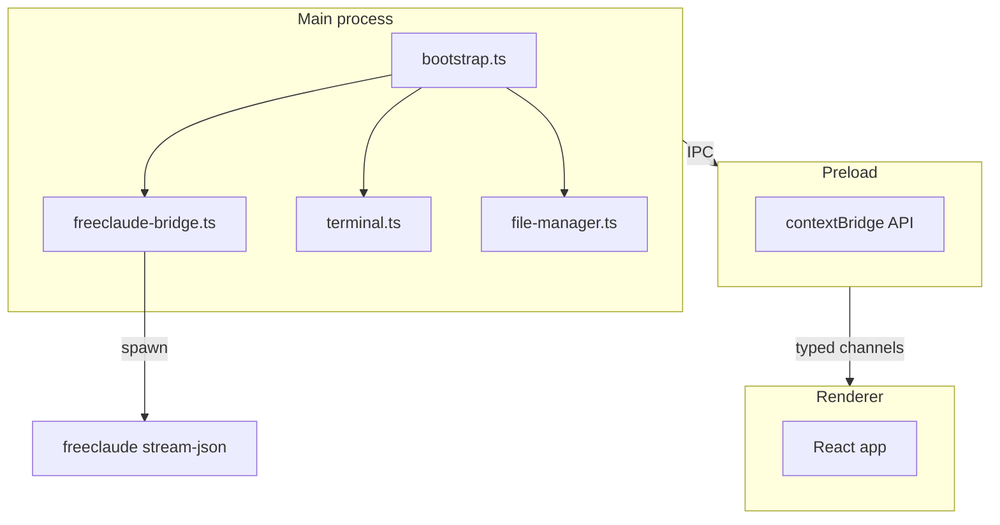

# 02 — FreeClaude Desktop (Electron)

## English

FreeClaude Desktop is an **Electron + Vite + React** shell documented in [`desktop/README.md`](../../desktop/README.md). It is **not** the Pyrfor Tauri IDE; it is a standalone UI that shells out to the same FreeClaude CLI the user would run in a terminal.

### Process model



| Layer | Responsibility |
|-------|------------------|
| **Main** | `desktop/src/main/bootstrap.ts` — window, [`freeclaude-bridge.ts`](../../desktop/src/main/freeclaude-bridge.ts), terminal PTY, file manager. |
| **Preload** | `desktop/src/preload/preload.ts` — exposes a narrow API via `contextBridge`. |
| **Renderer** | `desktop/src/renderer/` — React UI; validates payloads against shared schemas. |
| **IPC contract** | [`desktop/src/shared/ipc-contract.ts`](../../desktop/src/shared/ipc-contract.ts) — Zod-typed channel names and payloads. |

### CLI spawn contract

The bridge runs FreeClaude approximately as:

```text
freeclaude [-p] [--resume <sessionId>] --output-format stream-json <prompt>
```

It parses newline-delimited JSON events (`session_id`, assistant chunks, `result`, `is_error`). See also root [`docs/ARCHITECTURE.md`](../ARCHITECTURE.md) and bridge implementation for history stitching when `sessionId` is absent.

### Where settings live

| Concern | Path |
|---------|------|
| Providers / keys | `~/.freeclaude.json` (owned by CLI) |
| Desktop UI overrides | `<userData>/FreeClaude/config/settings.json` |
| Renderer session state | `localStorage` key `freeclaude-shell-state` |

---

## Русский

**FreeClaude Desktop** — отдельное приложение **Electron + Vite + React** ([`desktop/README.md`](../../desktop/README.md)). Оно запускает **тот же CLI**, что и в терминале, с форматом **`stream-json`**.

### Процессы

- **Main**: окно, мост к CLI, терминал, файлы — см. `bootstrap.ts`, `freeclaude-bridge.ts`.
- **Preload**: безопасный мост `contextBridge`.
- **Renderer**: React.
- **Контракт IPC**: `desktop/src/shared/ipc-contract.ts`.

Диаграмма **Process model** выше отражает поток IPC и вызов CLI.

### Настройки

Таблица **Where settings live** — разделение между CLI и Desktop.
