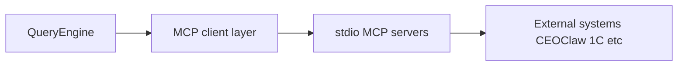

# 03 — MCP: CEOClaw, 1C OData, transport

## English

FreeClaude implements the **Model Context Protocol (MCP)** so tools can reach external systems over stdio/SSE-style transports. The authoritative user guide is [`docs/MCP.md`](../MCP.md).

### Built-in CEOClaw PM (in-process)

- **Implementation**: [`src/services/mcp/servers/ceoclawPm.ts`](../../src/services/mcp/servers/ceoclawPm.ts)
- **Tests / contract smoke**: [`src/services/mcp/servers/mcpServers.test.ts`](../../src/services/mcp/servers/mcpServers.test.ts)

| Tool | Purpose |
|------|---------|
| `pm_project_create` | New project |
| `pm_project_list` | List projects |
| `pm_task_create` | Add task |
| `pm_task_update` | Update task |
| `pm_evm` | Earned value metrics |
| `pm_status` | Health summary |

Data is in-memory in the reference server (production deployments may persist externally).

### Standalone CEOClaw MCP package

- **Path**: [`mcp-servers/ceoclaw-pm/`](../../mcp-servers/ceoclaw-pm/)
- **README**: [`mcp-servers/README.md`](../../mcp-servers/README.md)

Use this when wiring FreeClaude to an external MCP host instead of the bundled in-process definitions.

### 1C OData MCP

Read-only ERP integration — five tools (`odata_*`) documented in [`docs/MCP.md`](../MCP.md). Package under [`mcp-servers/onec-odata/`](../../mcp-servers/onec-odata/).

### How MCP relates to the CLI

Plugins can also declare MCP servers via manifests — see `src/utils/plugins/mcpPluginIntegration.ts` and related plugin schema docs.

---

## Русский

**MCP** в FreeClaude подключает внешние системы к циклу инструментов. Подробности — [`docs/MCP.md`](../MCP.md).

### CEOClaw PM

- Встроенный сервер: [`ceoclawPm.ts`](../../src/services/mcp/servers/ceoclawPm.ts)
- Отдельный пакет: [`mcp-servers/ceoclaw-pm/`](../../mcp-servers/ceoclaw-pm/)

Таблица инструментов — см. раздел **Built-in CEOClaw PM** выше.

### 1C OData

Пакет `mcp-servers/onec-odata/`, инструменты `odata_*`.

### Схема

Диаграмма **How MCP relates to the CLI** показывает цепочку QueryEngine → MCP client → stdio-серверы → внешние системы.
