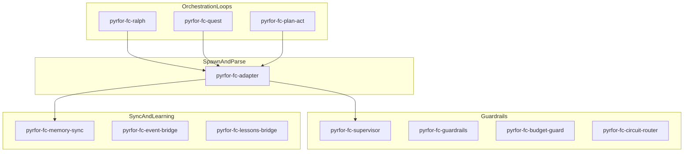
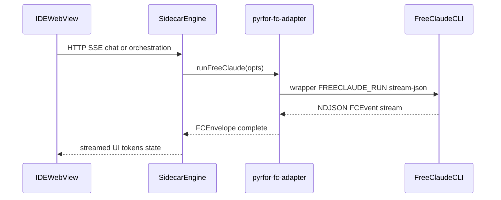

# 04 — Pyrfor Engine and FreeClaude integration

## English

This document summarizes the **Pyrfor** monorepo engine runtime and how it integrates with **FreeClaude**. Pyrfor source lives in a separate repository ([GitHub: pyrfor](https://github.com/alexgrebeshok-coder/pyrfor)); clone it next to FreeClaude or set your own checkout path when reading file links in Pyrfor docs.

### Monorepo layout (from Pyrfor README)

| Path | Role |
|------|------|
| `apps/pyrfor-ide` | Tauri desktop shell |
| `packages/engine` | Public engine package; `src/runtime` is the canonical desktop runtime |
| `packages/cli` | CLI surface |
| `vscode-extension/` | VS Code extension |
| `daemon/` | Legacy / service wrapper (Telegram, etc.) — not co-equal backend for Pyrfor.app |
| `prisma/`, `config/` | Shared schema and manifests |

Optional integrations (FreeClaude, CEOClaw, 1C, Telegram) are **adapters** — see Pyrfor [`docs/integrations.md`](https://github.com/alexgrebeshok-coder/pyrfor/blob/main/docs/integrations.md).

### Engine runtime map (`packages/engine/src/runtime`)

Representative modules (names match the Pyrfor engine tree on disk):

| Area | Files |
|------|--------|
| MCP | [`mcp-server.ts`](https://github.com/alexgrebeshok-coder/pyrfor/blob/main/packages/engine/src/runtime/mcp-server.ts), [`mcp-client.ts`](https://github.com/alexgrebeshok-coder/pyrfor/blob/main/packages/engine/src/runtime/mcp-client.ts), `pyrfor-mcp-server-fc.ts` |
| Subagents | [`subagents.ts`](https://github.com/alexgrebeshok-coder/pyrfor/blob/main/packages/engine/src/runtime/subagents.ts) |
| Memory | `memory-store.ts`, `prisma-memory-manager.ts` |
| Provider routing | `llm-provider-router.ts`, `pyrfor-fc-circuit-router.ts` |
| Multimodal | [`multimodal-router.ts`](https://github.com/alexgrebeshok-coder/pyrfor/blob/main/packages/engine/src/runtime/multimodal-router.ts) |
| A2A + FC | `a2a-client.ts`, `pyrfor-a2a-fc.ts` |
| FreeClaude | `pyrfor-fc-adapter.ts` and the `pyrfor-fc-*` graph (see below) |

### FreeClaude adapter surface

The barrel [`packages/engine/src/runtime/integrations.ts`](https://github.com/alexgrebeshok-coder/pyrfor/blob/main/packages/engine/src/runtime/integrations.ts) re-exports:

- **Core spawn**: `pyrfor-fc-adapter.ts` — `runFreeClaude(opts)` returns an async event stream plus final `FCEnvelope`.
- **Supervision & guardrails**: `pyrfor-fc-supervisor`, `pyrfor-fc-guardrails`, `pyrfor-fc-control`, `pyrfor-fc-budget-guard`, `pyrfor-fc-circuit-router`.
- **Memory & telemetry**: `pyrfor-fc-memory-sync`, `pyrfor-fc-event-bridge`, `pyrfor-fc-lessons-bridge`, `pyrfor-fc-skill-writer`, `pyrfor-cost-aggregate`, `pyrfor-trajectory-recorder`, …
- **Orchestration loops** (FC-side patterns): `pyrfor-fc-ralph`, `pyrfor-fc-quest`, `pyrfor-fc-plan-act`, `pyrfor-fc-best-of-n`, `pyrfor-fc-context-rotate`, `pyrfor-fc-early-stop`, `pyrfor-fc-struggle-detect`.
- **MCP / CEOClaw / A2A**: `pyrfor-mcp-server-fc`, `pyrfor-ceoclaw-mcp-fc`, `pyrfor-a2a-fc`.

### FCEnvelope and wrapper

`FCEnvelope` aggregates run outcome: `status`, `output`, `filesTouched`, `commandsRun`, `sessionId`, cost fields, `exitCode`, etc. The adapter spawns a **wrapper script** (configurable via `FCRunOptions.wrapperPath` or environment **`FREECLAUDE_RUN`**) which in turn invokes FreeClaude with the negotiated CLI flags and parses NDJSON / worker frames into `FCEvent` variants.

FreeClaude’s side of the contract is documented in this repo’s [CHANGELOG.md](../../CHANGELOG.md) (Pyrfor↔FC envelope, worktree snapshots, “stateless executor” semantics).

### CEOClaw on Pyrfor

[`pyrfor-ceoclaw-mcp-fc.ts`](https://github.com/alexgrebeshok-coder/pyrfor/blob/main/packages/engine/src/runtime/pyrfor-ceoclaw-mcp-fc.ts) — optional in-process MCP bridge (caller-injected client per `docs/integrations.md`).

### Multimodal router (Pyrfor)

[`multimodal-router.ts`](https://github.com/alexgrebeshok-coder/pyrfor/blob/main/packages/engine/src/runtime/multimodal-router.ts) decides reply modality (text/voice/document/…) for inbound kinds (voice/photo/document/video/…); includes sentiment heuristics for voice. This is **orthogonal** to FreeClaude’s own multimodal model features (e.g. image file reads in tools) but belongs to the same product story of multi-surface AI.

### Runtime directory `~/.pyrfor`

- Holds **runtime state** (orchestration logs, sessions, etc.), not the git tree.
- Pyrfor README: first-run contract prefers `~/.pyrfor/runtime.json`; legacy `pyrfor.json` paths are compatibility only.
- **Never paste secrets** from JSON configs into documentation or issues.

### Adapter module graph (concise)

### Sequence: IDE → sidecar gateway → `runFreeClaude` → stream-json

Per [Pyrfor IDE README](https://github.com/alexgrebeshok-coder/pyrfor/blob/main/apps/pyrfor-ide/README.md), the desktop app wraps **`packages/engine`** in a **Tauri sidecar** (`pyrfor-daemon`) with HTTP endpoints (`/api/chat/stream`, `/api/fs/*`, `/api/pty/*`, `/api/git`, …). When execution is delegated to FreeClaude, the adapter path conceptually sits in the engine runtime and shells out to the CLI wrapper.

Exact call graph depends on feature flags and mode (`pyrfor` vs `freeclaude` in the IDE API); this diagram is **intent-level**.

---

## Русский

Кратко о **движке Pyrfor** и интеграции с **FreeClaude**. Исходники — отдельный репозиторий [pyrfor на GitHub](https://github.com/alexgrebeshok-coder/pyrfor).

### Структура монорепо

См. таблицу **Monorepo layout** выше: `packages/engine/src/runtime` — канонический рантайм, `apps/pyrfor-ide` — Tauri IDE.

### Карта рантайма движка

Таблица **Engine runtime map** в английской секции перечисляет MCP, субагентов, память, роутинг провайдеров, мультимодальность, A2A и слой FreeClaude.

### Слой FreeClaude

Файл **`integrations.ts`** реэкспортирует адаптеры: ядро **`runFreeClaude`** в `pyrfor-fc-adapter.ts`, супервизия, память, события, Ralph/Quest/Plan-Act и т.д. (список в английской секции).

**Конверт `FCEnvelope`** и поток **`FCEvent`** описывают завершённый прогон CLI; путь к обёртке задаётся **`FREECLAUDE_RUN`** или опцией `wrapperPath`.

### CEOClaw и мультимодальность на Pyrfor

- **CEOClaw**: `pyrfor-ceoclaw-mcp-fc.ts`.
- **Мультимодальность**: `multimodal-router.ts` — выбор канала ответа для голоса/фото/документов и т.д.

### `~/.pyrfor`

Каталог данных и конфигурации рантайма; **не публиковать секреты**.

Диаграмма **Adapter module graph** иллюстрирует крупные группы модулей (spawn, guardrails, sync, loops).

Диаграмма **Sequence: IDE → sidecar gateway → runFreeClaude** (английская секция) описывает связку WKWebView ↔ sidecar `packages/engine` ↔ обёртка FreeClaude и поток `stream-json` (уровень намерения, без привязки к каждому флагу).
