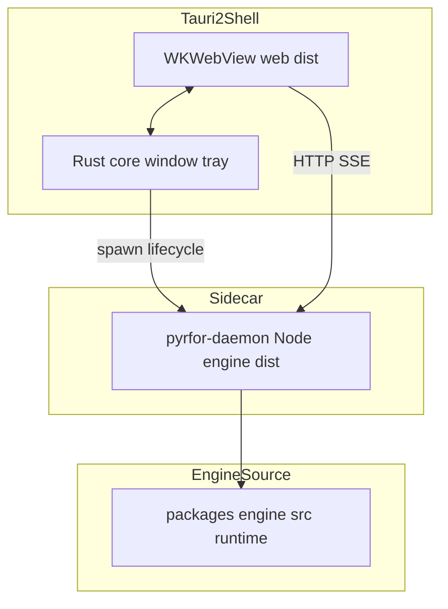

# 05 — Pyrfor IDE and VS Code extension

## English

### Pyrfor IDE (`apps/pyrfor-ide`)

- **Package**: `@pyrfor/ide` — see `apps/pyrfor-ide/package.json` in the Pyrfor repo.
- **Stack**: **Tauri** native shell + **web** frontend (`apps/pyrfor-ide/web`), with scripts to build a **sidecar** binary (`build:sidecar`).
- **Typical dev commands** (from Pyrfor README): `pnpm ide:build:web`, `pnpm ide:build:sidecar`, `tauri:build`.

The web layer talks to engine capabilities through its API module layer. Execution can be expressed in types such as **`ExecutionMode`: `'pyrfor' | 'freeclaude'`** — see [`apps/pyrfor-ide/web/src/lib/api.ts`](https://github.com/alexgrebeshok-coder/pyrfor/blob/main/apps/pyrfor-ide/web/src/lib/api.ts) in the Pyrfor checkout.

**Confirmed layout** (from [Pyrfor IDE `README.md` — Architecture](https://github.com/alexgrebeshok-coder/pyrfor/blob/main/apps/pyrfor-ide/README.md#architecture)):

- **WKWebView** hosts the Vite production bundle under `apps/pyrfor-ide/web/dist` (React, Monaco, xterm, chat, terminal, Git panel).
- **Rust Tauri core** (thin): window/tray/menu, **sidecar lifecycle** (spawn/restart/kill), shell plugin, window-state plugin, updater, keyring (planned phases).
- **Sidecar `pyrfor-daemon`**: Node 22 + `packages/engine/dist`; HTTP gateway on a dynamic port (printed to stdout); REST-style families such as `/api/fs/*`, `/api/chat/stream`, `/api/pty/*`, `/api/git`.

### VS Code extension (`vscode-extension/`)

Smaller TypeScript surface (~24 `src/*.ts` files) focused on editor integration:

| File / area | Role |
|-------------|------|
| [`extension.ts`](https://github.com/alexgrebeshok-coder/pyrfor/blob/main/vscode-extension/src/extension.ts) | Activation / command registration |
| [`universal-api.ts`](https://github.com/alexgrebeshok-coder/pyrfor/blob/main/vscode-extension/src/universal-api.ts) | API façade for extension features |
| [`execution-mode.ts`](https://github.com/alexgrebeshok-coder/pyrfor/blob/main/vscode-extension/src/execution-mode.ts) | Mode switching aligned with IDE concepts |
| [`daemon-client.ts`](https://github.com/alexgrebeshok-coder/pyrfor/blob/main/vscode-extension/src/daemon-client.ts) | Talks to optional daemon / service layer |
| [`panels/chat-view.ts`](https://github.com/alexgrebeshok-coder/pyrfor/blob/main/vscode-extension/src/panels/chat-view.ts), `tasks.ts`, `concept-trace-view.ts` | Webview / tree panels |
| [`file-sync.ts`](https://github.com/alexgrebeshok-coder/pyrfor/blob/main/vscode-extension/src/file-sync.ts), [`diff-view.ts`](https://github.com/alexgrebeshok-coder/pyrfor/blob/main/vscode-extension/src/diff-view.ts), [`inline.ts`](https://github.com/alexgrebeshok-coder/pyrfor/blob/main/vscode-extension/src/inline.ts) | Editor-adjacent workflows |

Tests live alongside modules under `src/__tests__/`.

---

## Русский

### IDE Pyrfor

- **Tauri 2** + веб в `apps/pyrfor-ide/web`; **sidecar** `pyrfor-daemon` с движком `packages/engine` — см. [README IDE (Architecture)](https://github.com/alexgrebeshok-coder/pyrfor/blob/main/apps/pyrfor-ide/README.md#architecture).
- **Режимы** `pyrfor` | `freeclaude` — [`api.ts`](https://github.com/alexgrebeshok-coder/pyrfor/blob/main/apps/pyrfor-ide/web/src/lib/api.ts).

Диаграмма **Tauri2Shell** в английской секции отражает WKWebView, Rust-оболочку и sidecar с HTTP/SSE к движку.

### Расширение VS Code

Основные точки входа: `extension.ts`, `universal-api.ts`, `execution-mode.ts`, клиент демона, панели чата/задач/трейсов, синхронизация файлов и diff — см. таблицу в английской секции (ссылки на GitHub ведут в исходники Pyrfor).
