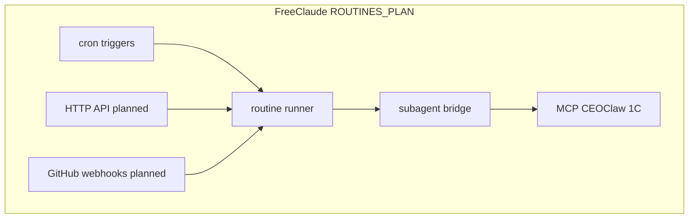
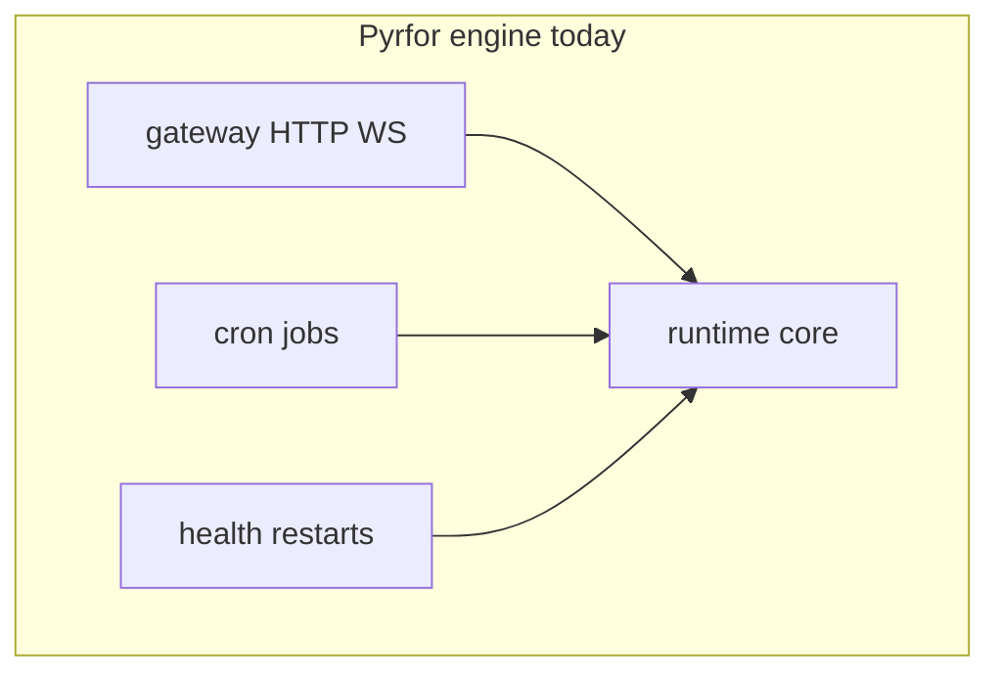

# 06 — Routines, cron, and “unification” roadmap

## English

“Partial unification” across applications means **shared triggers** (time, HTTP, webhooks), **shared execution** (agent runs, MCP calls), and **shared persistence** (tasks, memory, logs)—implemented differently today in **FreeClaude** vs **Pyrfor**, with room to converge.

- **Current multimodal (FreeClaude)** — image reads and Gemini preset: see [01-freeclaude-cli-core.md](./01-freeclaude-cli-core.md) (Multimodal bullet) and Pyrfor `multimodal-router.ts` in [04](./04-pyrfor-engine-and-fc-integration.md).

### FreeClaude: Routines plan

[`ROUTINES_PLAN.md`](../../ROUTINES_PLAN.md) defines a **Routine Engine** with:

- **Scheduler** (cron) — partial today via `CronCreateTool` and durable paths.
- **API server** (HTTP POST triggers) — planned.
- **GitHub webhooks** — planned.
- **Routine runner** → loads config → spawns subagents via `agentBridge` → notifications.

It explicitly compares parity with Anthropic Claude Code Routines and lists MCP connectors (CEOClaw PM, 1C OData) in automation stories (e.g. 1C event → analysis → CEOClaw update).

### Pyrfor: engine-level scheduling

The Pyrfor root README lists **cron**, **health**, and **gateway** as part of the canonical runtime (`packages/engine/src/runtime`). User-level JSON under `~/.pyrfor` can define **cron jobs** and gateway settings (see your local `pyrfor.json` / `runtime.json` **without committing secrets**).

Conceptually:

### How to read “unification”

| Dimension | FreeClaude (today / plan) | Pyrfor (today) |
|-----------|---------------------------|----------------|
| Time triggers | Cron tool + routines plan | Engine cron config |
| Remote triggers | Planned HTTP / GitHub | Gateway + optional Telegram/daemon |
| Execution kernel | CLI `QueryEngine` | Engine runtime + FC adapter |
| PM integration | MCP CEOClaw in CLI | `pyrfor-ceoclaw-mcp-fc` adapter |

Documentation should always label features **as-built** vs **planned** to avoid confusion.

---

## Русский

Под **«частичным объединением»** имеется в виду общая идея: **триггеры** (время, HTTP, вебхуки) → **исполнение** (агенты, MCP) → **память/логи** — с разной степенью готовности в FreeClaude и Pyrfor.

### FreeClaude

**Мультимодальность:** изображения и пресет Gemini — [01](./01-freeclaude-cli-core.md); маршрутизация ответов на стороне Pyrfor — [04](./04-pyrfor-engine-and-fc-integration.md).

См. [`ROUTINES_PLAN.md`](../../ROUTINES_PLAN.md): планируемый **Routine Engine** (cron, API, GitHub → runner → субагенты → MCP). Диаграмма **planned** выше.

### Pyrfor

В рантайме движка уже есть **шлюз**, **cron**, **health** (см. README Pyrfor). Локальные JSON в `~/.pyrfor` задают расписание; **не светите секреты**.

### Сводка

Таблица **How to read “unification”** сопоставляет оси: триггеры, удалённые вызовы, ядро исполнения, CEOClaw.

В документации явно помечайте **уже сделано** и **в планах**.
